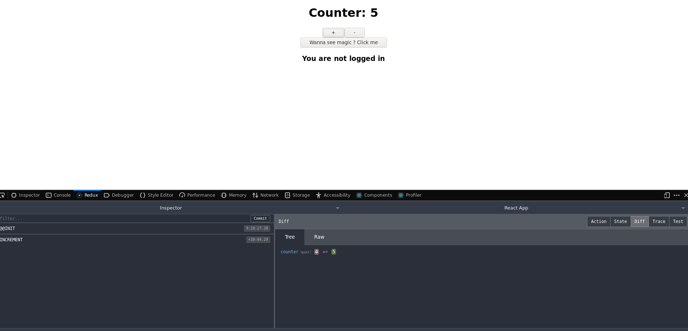
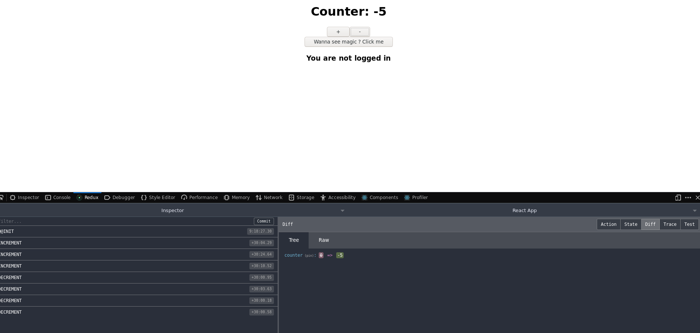
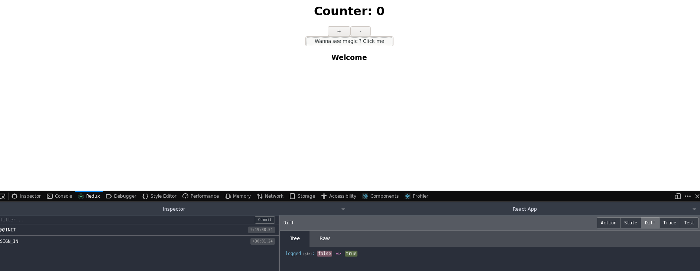

# Zenkai
A basic react-redux application for newbie starters. You will learn how to use redux for global state managemenet.

[](https://github.com/nightwarriorftw/zenkai/issues) [](https://github.com/nightwarriorftw/zenkai/network/members) [](hhttps://github.com/nightwarriorftw/zenkai/stargazers)   [](https://twitter.com/intent/follow?screen_name=nightwarriorftw) [](https://telegram.me/nightwarriorftw)


## :nut_and_bolt: Development


#### 1. Clone the Repository

```Bash
git clone https://github.com/nightwarriorftw/zenkai.git
cd zenkai
```

#### 2. Install the dependencies

```BASH
npm install
```

#### 3. Run server:

```BASH
npm start
```

# :camera: Gallery

Pictures of project.
 
 
 
 
